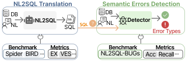

# NL2SQL-BUGs: A Benchmark for Detecting Semantic Errors in NL2SQL Translation

<p align="center">

</p>


## 🔍 Overview

NL2SQL-BUGs is the benchmark dedicated to detecting and categorizing semantic errors in Natural Language to SQL (NL2SQL) translation. While state-of-the-art NL2SQL models have made significant progress in translating natural language queries to SQL, they still frequently generate semantically incorrect queries that may execute successfully but produce incorrect results. This benchmark aims to support research in semantic error detection, which is a prerequisite for any subsequent error correction.
- **Two-Level Taxonomy**: A comprehensive classification system for semantic errors with 9 main categories and 31 subcategories
- **Expert-Annotated Dataset**: 2,018 instances including 1,019 correct examples and 999 semantically incorrect examples
- **Detailed Error Annotations**: Each incorrect example is meticulously annotated with specific error types

## 📊 Data Statistics

Our taxonomy classifies semantic errors in NL2SQL translation into 9 main categories and 31 subcategories:
- **Total instances**: 2,018
- **Correct examples**: 1,019
- **Incorrect examples (with semantic errors)**: 999
- **Main error categories**: 9
- **Error subcategories**: 31
<p align="center">

</p>

## 🚀 Dataset

Our database is consistent with BIRD benchmark. You can download the database from either:
- [Google Drive](https://drive.google.com/file/d/1AL_tL7unPxjxfoHAiMvU_NWIae4dy3A2/view?usp=drive_link)
- [BIRD Official Website](https://bird-bench.github.io/)

You can find NL2SQL-BUGs label and error type in `./data/` dir

## 📈 Evaluation
We evaluate semantic error detection performance using the following metrics:

- **Overall Accuracy**: Percentage of correctly identified instances (correct or incorrect)
- **Negative Precision (NP)**: Proportion of correctly predicted incorrect cases out of all predicted incorrect cases
- **Negative Recall (NR)**: Proportion of correctly predicted incorrect cases out of all actual incorrect cases
- **Positive Precision (PP)**: Proportion of correctly predicted correct cases out of all predicted correct cases
- **Positive Recall (PR)**: Proportion of correctly predicted correct cases out of all actual correct cases
- **Type-Specific Accuracy (TSA)**: Accuracy for each specific error type

## 📝 Citation

If you use NL2SQL-BUGs in your research, please cite our paper:

```bibtex
@inproceedings{liu2024nl2sqlbugs,
  title={NL2SQL-BUGs: A Benchmark for Detecting Semantic Errors in NL2SQL Translation},
  author={Liu, Xinyu and Shen, Shuyu and Li, Boyan and Tang, Nan and Luo, Yuyu},
  booktitle={arxiv},
  year={2025}
}
```